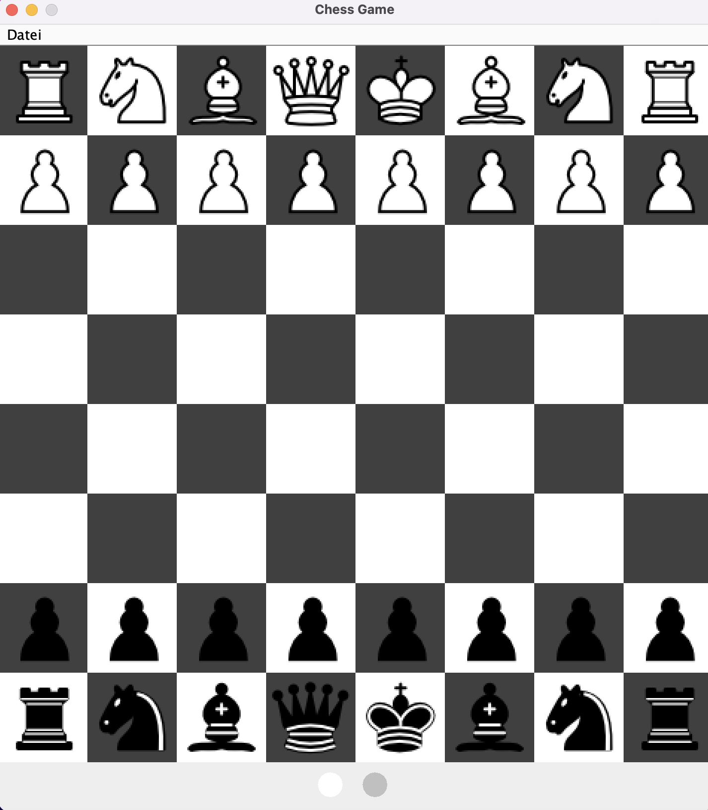
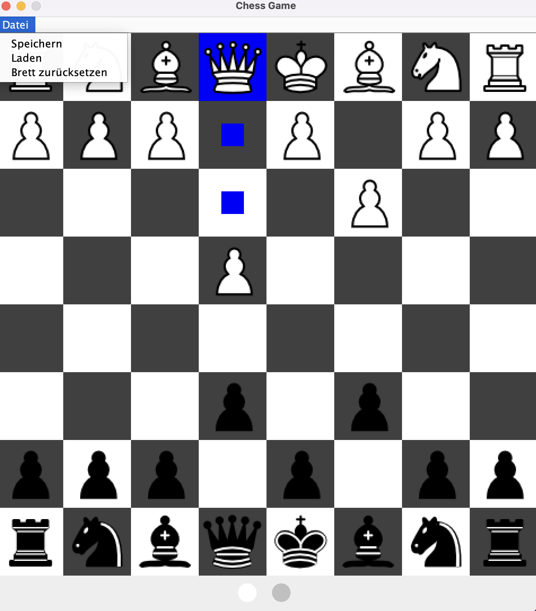

# Schachspiel – Universitätsprojekt

Dieses Projekt entstand im Rahmen des Programmiertechnischen Praktikums (PTP) 
an der Universität Hamburg und wurde gemeinsam mit einem Projektpartner entwickelt.

Ziel war die Entwicklung eines grafischen Schachspiels für zwei Spieler an einem 
Rechner. Dabei lag der Fokus auf einer objektorientierten Struktur, der Umsetzung 
der Schachregeln und einer übersichtlichen Benutzeroberfläche.

## Funktionen

- Grafisches 8×8-Schachbrett
- Auswahl und Bewegung der Figuren per Maus
- Anzeige legaler Zielfelder
- Zugprüfung für alle Schachfiguren
- Spielerwechsel und Anzeige des aktiven Spielers
- Erkennung von Schach und Schachmatt
- Rochade und en passant
- Speichern und Laden von Spielständen im FEN-Format
- Zurücksetzen des Schachbretts

## Mein Beitrag

Mein Schwerpunkt im Projekt lag auf:

- Entwicklung der grafischen Benutzeroberfläche mit Java Swing
- Umsetzung von `ChessWindow`, `ChessBoardPanel` und `PlayerIndicator`
- Anbindung der Benutzeroberfläche an die Controller
- Implementierung der grundlegenden Bewegungsmuster der einzelnen Schachfiguren
  in `PieceType`
- Tests der von mir implementierten Komponenten
- JavaDoc-Dokumentation
- Mitarbeit bei Planung, Integration und Projektdokumentation

## Technologien

- Java
- Java Swing
- JUnit 5
- Git & GitLab
- Eclipse

## Screenshots

### Startansicht

### Spielansicht

## Projektstruktur

Das Projekt ist in mehrere Bereiche aufgeteilt:

- `app` – Einstiegspunkt der Anwendung
- `ui` – grafische Benutzeroberfläche
- `controller` – Verarbeitung der Benutzereingaben
- `model` – Spiellogik, Schachregeln und Spielzustand
- `unit` – Hilfsschnittstelle für die Bewegungsregeln
- `test` – JUnit-Tests

## Ausführen

Voraussetzung ist Java 21 oder neuer.

Das Projekt kann beispielsweise in Eclipse als bestehendes Java-Projekt importiert
werden. Anschließend kann die Anwendung über `src/app/Main.java` gestartet werden.

